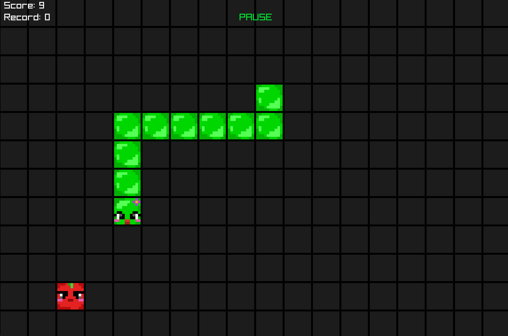

# Snake Game (C + Raylib)

В этом репозитории представлена простая, красочная и быстрая реализация классической игры **Snake** с графическим интерфейсом на **C** с использованием **[Raylib](https://www.raylib.com/)**. Игра поддерживает текстуры, звуки, паузу, ручное управление клавишами, стартовый экран с инструкциями и автоматический режим, использующий гамильтонов цикл.

## Содержание

- [Snake Game (C + Raylib)](#snake-game-c--raylib)
  - [Содержание](#содержание)
  - [Особенности](#особенности)
  - [Скриншоты](#скриншоты)
    - [Стартовый экран с инструкцией](#стартовый-экран-с-инструкцией)
    - [Ручное управление](#ручное-управление)
    - [Автопилот по циклу Гамильтона](#автопилот-по-циклу-гамильтона)
    - [Экран окончания игры при достижении нового рекорда](#экран-окончания-игры-при-достижении-нового-рекорда)
  - [Запуск](#запуск)
    - [Требования](#требования)
    - [Установка Raylib для Linux](#установка-raylib-для-linux)
    - [Сборка](#сборка)
    - [Запуск исполняемого файла](#запуск-исполняемого-файла)
  - [Управление](#управление)
  - [Автопилот](#автопилот)
  - [Структура проекта](#структура-проекта)
  - [Планы на будущее](#планы-на-будущее)

## Особенности

- Полный игровой цикл: старт → игра → победа/поражение → перезапуск.
- Автопилот на основе **Гамильтонова цикла**.
- Графика с текстурами головы, тела и яблока.
- Звуковые эффекты: поедание, поражение, победа.
- Фоновая музыка `.mp3`.
- Отображение текущего счёта и рекорда.
  
## Скриншоты

### Стартовый экран с инструкцией


### Ручное управление



### Автопилот по циклу Гамильтона


### Экран окончания игры при достижении нового рекорда


## Запуск

### Требования

- [Raylib](https://github.com/raysan5/raylib) — графика и звук.
- GCC или Clang (например, `gcc`, `clang`).
- macOS / Linux (текущая сборка настроена под macOS).
  
### Установка Raylib для Linux

```bash
sudo apt install libraylib-dev
```

Или, если Raylib не установлен глобально, можно использовать raylib как статическую библиотеку.

### Сборка

Необходимо создать исполняемый файл с помощью:

```bash
make
```

Если make не установлен, то можно собрать вручную:

```bash
gcc сnake.c -o сnake \
  -lraylib -L. -lglfw3 \
  -framework Cocoa -framework IOKit -framework OpenGL
```

### Запуск исполняемого файла

```bash
./cnake
```

## Управление

| Клавиша     | Действие                          |
|-------------|-----------------------------------|
| `W` / `↑`   | Движение вверх                    |
| `S` / `↓`   | Движение вниз                     |
| `A` / `←`   | Движение влево                    |
| `D` / `→`   | Движение вправо                   |
| `SPACE`     | Пауза / продолжить                |
| `R`         | Перезапуск игры                   |
| `B`         | Включить / выключить автопилот    |
| `ESC`       | Выход из игры                     |
| `TAB`       | Стартовый экран                   |

## Автопилот

При нажатии клавиши B включается автоматический режим движения змеи по Гамильтоновому циклу (обход всей доски без самопересечений), который позволяет змее выживать максимально долго. Это хороший способ наблюдать за алгоритмом в действии.

## Структура проекта

- **Cnake/**
  - **source/**
    - **textures/** —  текстуры змеи и яблока.
    - **sounds/** —  звуки: eat, dead, win + фоновая музыка.
  - **screenshots/** — скриншоты игрового процесса.
  - `cnake.c` — основной исходный код игры.
  - `makefile` — файл сборки проекта с флагами компиляции.
  - `README.md` — описание проекта и инструкция по запуску.

## Планы на будущее

- [ ] Добавить анимацию.
- [ ] Оптимизация автопилота (расширение за рамки цикла).
- [ ] Поддержка highscore.
