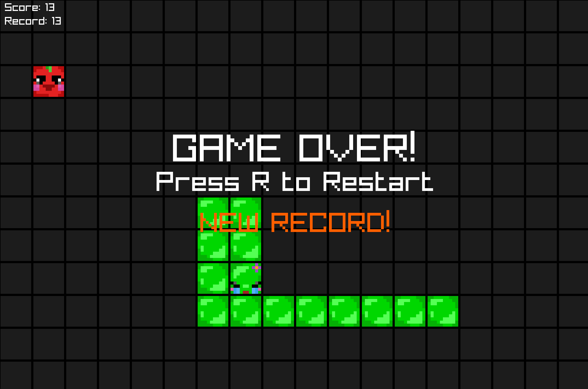

# Snake Game (C + Raylib)

В этом репозитории представлена простая, красочная и быстрая реализация классической игры **Snake** с графическим интерфейсом на **C** с использованием **[Raylib](https://www.raylib.com/)**. Игра поддерживает текстуры, паузу, ручное управление клавишами, стартовый экран с инструкциями и автоматический режим, использующий гамильтонов цикл.

## Содержание

- [Snake Game (C + Raylib)](#snake-game-c--raylib)
  - [Содержание](#содержание)
  - [Особенности](#особенности)
  - [Скриншоты](#скриншоты)
    - [Стартовый экран с инструкцией](#стартовый-экран-с-инструкцией)
    - [Ручное управление](#ручное-управление)
    - [Автопилот по циклу Гамильтона](#автопилот-по-циклу-гамильтона)
    - [Экран окончания игры при достижении нового рекорда](#экран-окончания-игры-при-достижении-нового-рекорда)
  - [Запуск](#запуск)
    - [Зависимости](#зависимости)
    - [Установка Raylib для Linux](#установка-raylib-для-linux)
    - [Сборка](#сборка)
    - [Запуск](#запуск-1)
  - [Управление](#управление)
  - [Автопилот](#автопилот)
  - [Структура проекта](#структура-проекта)
  - [Планы на будущее](#планы-на-будущее)

## Особенности
- Графический интерфейс с текстурами
- Управление клавишами **WASD** или **стрелками**
- Автоматический режим движения змейки (`B`)
- Пауза (`SPACE`)
- Перезапуск (`R`)
- Подсчёт очков и отображение **рекорда**
- Надпись `NEW RECORD!` при достижении нового рекорда
- Гамильтонов цикл для обхода поля в автоматическом режиме
## Скриншоты
### Стартовый экран с инструкцией

### Ручное управление

### Автопилот по циклу Гамильтона

### Экран окончания игры при достижении нового рекорда


## Запуск

### Зависимости

- [Raylib](https://github.com/raysan5/raylib)
- GCC или Clang (например, `gcc`, `clang`)
- macOS / Linux (текущая сборка настроена под macOS)
###  Установка Raylib для Linux

```bash
sudo apt install libraylib-dev
```
Или, если Raylib не установлен глобально, можно использовать raylib как статическую библиотеку.
### Сборка

Необходимо создать исполняемый файл с помощью:

```bash
make
```
Если make не установлен, то можно собрать вручную:
```bash
gcc snake.c -o snake \
  -lraylib -L. -lglfw3 \
  -framework Cocoa -framework IOKit -framework OpenGL
```
### Запуск
```bash
./snake
```

## Управление

| Клавиша     | Действие                          |
|-------------|-----------------------------------|
| `W` / `↑`   | Движение вверх                    |
| `S` / `↓`   | Движение вниз                     |
| `A` / `←`   | Движение влево                    |
| `D` / `→`   | Движение вправо                   |
| `SPACE`     | Пауза / продолжить                |
| `R`         | Перезапуск игры                   |
| `B`         | Включить / выключить автопилот    |
| `ESC`       | Выход из игры                     |

## Автопилот

При нажатии клавиши B включается автоматический режим движения змеи по Гамильтоновому циклу (обход всей доски без самопересечений), который позволяет змее выживать максимально долго. Это хороший способ наблюдать за алгоритмом в действии.
 
## Структура проекта

- **snake-game/**
  - **textures/** — папка с текстурами змеи и яблока
    - `snake_head_final.png` — текстура головы змеи
    - `snake_head_dead.png` — текстура мёртвой головы змеи
    - `snake_body.png` — текстура тела змеи
    - `apple.png` — текстура яблока
  - **screenshots/** — скриншоты игрового процесса
    - `gameplay1.png` — cтартовый экран с инструкцией
    - `gameplay2.png` — ручное управление
    - `gameplay3.png` — автопилот по циклу Гамильтона
    - `gameplay4.png` — экран окончания игры
  - `snake.c` — основной исходный код игры
  - `Makefile` — файл сборки проекта с флагами компиляции
  - `README.md` — описание и инструкция по запуску


## Планы на будущее
	•	Звуки для еды и столкновения
	•	Анимация смерти змеи
	•	Оптимизация автопилота (расширение за рамки цикла)
	•	Поддержка highscore
	•	Добавить эффекты: мигание, вспышки и т.п.
